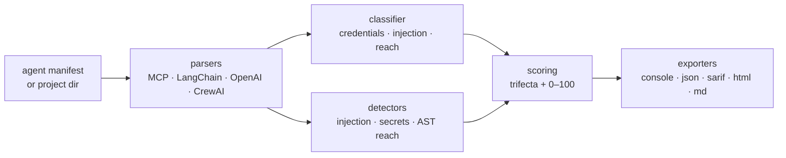

<a name="top"></a>
<div align="center">


# AEGIS

### AI Agent Permission & Access Auditor — surfaces the lethal trifecta of credentials + injection + reach


[](https://pypi.org/project/cognis-aegis/) [](https://github.com/cognis-digital/aegis/actions) [](https://github.com/cognis-digital/aegis/actions/workflows/ports.yml) [](LICENSE) [](https://github.com/cognis-digital)

*AI Security & Governance — securing LLMs, agents, and the MCP supply chain.*

</div>

```bash
pip install cognis-aegis
aegis audit manifest.json     # → trifecta findings in milliseconds
aegis scan .                  # → walk a project: MCP + LangChain + secrets + reach
```

AEGIS answers one question: **can a single prompt injection turn this agent into an exfiltration tool?** It does so by surfacing the **lethal trifecta** — when one agent simultaneously has access to **(1) private data / credentials**, **(2) untrusted input**, and **(3) the reach to act externally**. Hold all three and an attacker who controls any untrusted input can read your secrets and send them out. AEGIS finds that combination *before* it ships.

It is **static, passive, and offline** — it reads manifests and source, never executes scanned code and never touches the network.

---


<!-- cognis:example:start -->
## 🔎 Example output

Real, reproducible output from the tool — runs offline:

```console
$ aegis-emit --version
aegis 0.1.2
```

```console
$ aegis-emit --help
usage: aegis [-h] [--version] {audit,scan} ...

AEGIS - AI Agent Permission & Access Auditor. Detects the lethal trifecta
(credentials + untrusted input + external reach) that makes an AI agent
exploitable by prompt injection.

positional arguments:
  {audit,scan}
    audit       Audit an agent manifest (JSON) for trifecta exposure.
    scan        Scan a project directory (MCP/LangChain/OpenAI/CrewAI) for
                risk.

options:
  -h, --help    show this help message and exit
  --version     show program's version number and exit
```

> Blocks above are real `aegis` output — reproduce them from a clone.

**Sample result format** _(illustrative values — run on your own data for real findings):_

```
{
"findings": [
    {
        "id": "1234567890",
        "title": "Suspicious Network Traffic",
        "description": "Unusual network activity detected from IP 192.168.1.100",
        "categories": ["Network", "Malware"],
        "severity": "Medium"
    },
    {
        "id": "2345678901",
        "title": "Unauthorized System Access",
        "description": "User 'johndoe' accessed system without permission",
        "categories": ["Authentication", "Privilege Escalation"],
        "severity": "High"
    }
]
}
```

<!-- cognis:example:end -->

## Two ways to run it

AEGIS has two complementary engines, both exposed on the CLI:

| Command | Input | What it does |
|---|---|---|
| **`aegis audit <manifest.json>`** | one AI-agent manifest (JSON) | Classifies every declared capability onto the three trifecta axes and reports agents holding all three (`critical`), two of three (`high`), or routing untrusted input into shell/exec (`critical`, injection→RCE). |
| **`aegis scan <dir>`** | a project directory | Walks the tree, parses **MCP configs, LangChain/`@tool` source, OpenAI-Assistant exports, CrewAI YAML**, runs the static detectors (prompt-injection seeds, hard-coded secrets, AST-level shell/`eval` reach), scores `0–100`, and renders **console / JSON / SARIF / HTML / Markdown**. |

<a name="usage"></a>
## Usage — step by step

1. **Install** (Python 3.10+, zero runtime deps):
   ```bash
   pip install cognis-aegis            # PyPI
   # or from source:
   pip install -e .                    # or: pipx install "git+https://github.com/cognis-digital/aegis.git"
   ```
2. **Audit an agent manifest** (human-readable table):
   ```bash
   aegis audit demos/01-basic/agents.json
   ```
3. **Read the output as JSON** (findings, axes, per-axis capabilities, fixes):
   ```bash
   aegis audit demos/01-basic/agents.json --format json | jq '.findings'
   ```
4. **Scan a whole project** and emit SARIF for GitHub Code Scanning:
   ```bash
   aegis scan . --format sarif -o aegis.sarif
   ```
5. **Interpret the verdict** — each finding names the dangerous capability combination and a remediation; the header reports the worst severity and a composite risk score.
6. **Gate CI on exposure** — exit `1` when any finding at/above the threshold is present, `0` otherwise, `2` on a missing/invalid manifest:
   ```yaml
   - run: pip install cognis-aegis && aegis scan . --fail-on high   # non-zero fails the job
   ```


## Contents

- [Why aegis?](#why) · [Features](#features) · [Quick start](#quick-start) · [Worked example](#example) · [Output formats](#formats) · [Architecture](#architecture) · [AI stack](#ai-stack) · [Polyglot ports](#ports) · [Edge / air-gap](#edge) · [How it compares](#how-it-compares) · [Scope & safety](#scope) · [Integrations](#integrations) · [Install anywhere](#install-anywhere) · [Related](#related) · [Contributing](#contributing)

<a name="why"></a>
## Why aegis?

AI Agent Permission & Access Auditor — surfaces the lethal trifecta of credentials + injection + reach — without standing up heavyweight infrastructure.

`aegis` is single-purpose, scriptable, and self-hostable: point it at a manifest or a directory, get prioritized results in the format your workflow already speaks (table · JSON · SARIF · HTML · Markdown), gate CI on it, and let agents drive it over MCP. The core is **pure Python standard library** — no third-party runtime dependencies, no network calls, no telemetry.

<div align="right"><a href="#top">↑ back to top</a></div>

<a name="features"></a>
## Features

- **Lethal-trifecta detection** — flags agents that combine credential/private-data access + untrusted input + external reach.
- **Injection→RCE detection** — independently flags agents that route untrusted input into a shell/`exec`/deploy capability.
- **Capability classifier** — 100+ keyword signatures plus an explicit-scope map (`read:secrets`, `net:outbound`, `exec:shell`, …) over tool names, descriptions, scopes and permissions.
- **Framework parsers** — MCP (`mcp.json` / `claude_desktop_config.json`), LangChain (`@tool` + `Tool(...)`), OpenAI Assistants export, CrewAI YAML.
- **Static detectors** — prompt-injection seeds (imperative override, role hijack, zero-width / RTL Unicode, system-prompt extraction), hard-coded credentials (OpenAI/Anthropic/GitHub/AWS/GCP/Stripe/Slack), and AST-based shell/`eval`/`subprocess(shell=True)`/unsafe-deserialization reach.
- **Deterministic 0–100 risk score** + a **compliance crosswalk** (OWASP LLM Top 10, MITRE ATLAS, CWE, NIST 800-53).
- **Five output formats** — `console`, `json`, `sarif` (2.1.0), `html`, `markdown`.
- **CI-native** — `--fail-on {critical,high,medium,low,none}` exit gating.
- **Polyglot** — Python (reference) + Go, Rust, JavaScript/Node, and POSIX-shell ports of the `audit` command, each verified in CI.
- **Runs on Linux/macOS/Windows · Docker · devcontainer.**

<div align="right"><a href="#top">↑ back to top</a></div>

<a name="quick-start"></a>
## Quick start

```bash
pip install cognis-aegis
aegis --version
aegis audit demos/01-basic/agents.json     # audit one manifest
aegis scan .                               # scan current project
aegis scan . --format json                 # machine-readable
aegis scan . --fail-on high                # CI gate (non-zero exit)
```

<div align="right"><a href="#top">↑ back to top</a></div>

<a name="example"></a>
## Worked example

The bundled `demos/01-basic/agents.json` describes four agents. `support-bot` can read the support inbox (**injection** — untrusted email), query the billing DB (**credentials**), and send email (**reach**) — the full trifecta:

```console
$ aegis audit demos/01-basic/agents.json
AEGIS audit  |  agents scanned: 4  |  findings: 4  |  worst: critical
------------------------------------------------------------------------
[CRIT] support-bot: Lethal trifecta: credentials + injection + reach
        axes: credentials, injection, reach
        credentials  <- billing_db_query
        injection    <- read_email
        reach        <- send_email
        fix: This agent can access sensitive data, ingest untrusted input,
             AND act on the outside world. Break the trifecta by removing one axis.

[HIGH] deploy-agent: Two of three trifecta axes present
        axes: injection, reach
        ...
[CRIT] deploy-agent: Untrusted input can reach code execution
        ...
[HIGH] summarizer: Two of three trifecta axes present
        ...
```

`calculator` (a single benign `compute` capability) produces **no finding**. Exit code is `1` because a `critical` is present — perfect for a CI gate.

As JSON:

```console
$ aegis audit demos/01-basic/agents.json --format json | jq '{worst: .worst_severity, n: .finding_count}'
{ "worst": "critical", "n": 4 }
```

Scanning the intentionally-vulnerable `coding-assistant` demo (an MCP config + a LangChain agent) surfaces hard-coded keys, a `subprocess(shell=True)` call, an `eval()`, an injection seed in a tool docstring, and the trifecta:

```console
$ aegis scan demos/coding-assistant
AEGIS v0.1.2  —  Cognis Digital / Cognis Neural Suite
COMPOSITE SCORE:  100.0 / 100  (CRITICAL)
Findings: 4 critical, 3 high, 0 medium, 0 low, 0 info

⚠️  LETHAL TRIFECTA DETECTED in agents:
     • python:agent.py
   (private data access + untrusted content + external comms = exfil capable)

[CRITICAL] AEG-REACH-002  subprocess with shell=True
[CRITICAL] AEG-SEC-001    Hardcoded credential: OpenAI API key
[CRITICAL] AEG-REACH-001  Shell/eval reach: `eval`
[HIGH    ] AEG-INJ-001    Imperative override
...
```

<div align="right"><a href="#top">↑ back to top</a></div>

<a name="formats"></a>
## Output formats

`aegis scan` renders the same `ScanResult` five ways:

| Format | Flag | Use |
|---|---|---|
| Console | `--format console` (default) | Human triage in a terminal. |
| JSON | `--format json` | Pipe into agents, jq, or any tool. |
| SARIF 2.1.0 | `--format sarif` | GitHub Code Scanning / any SARIF viewer. |
| HTML | `--format html` | A standalone, self-contained audit report (filable as NIST AI RMF / EU AI Act / ISO 42001 evidence). |
| Markdown | `--format markdown` | Drop into a PR comment or issue. |

The `aegis audit` command renders `table` (default) or `json`.

<div align="right"><a href="#top">↑ back to top</a></div>

<a name="architecture"></a>
## Architecture



Everything is read-only and offline: parsers and the AST reach-analyzer **parse** code, they never run it.

<div align="right"><a href="#top">↑ back to top</a></div>

<a name="ai-stack"></a>
## Use it from any AI stack

`aegis` is interoperable with every popular way of using AI:

- **MCP server** — `aegis mcp` (Claude Desktop, Cursor, Cognis.Studio, [uncensored-fleet](https://github.com/cognis-digital/uncensored-fleet)); install the `[mcp]` extra.
- **OpenAI-compatible / JSON** — pipe `aegis scan . --format json` into any agent or LLM.
- **LangChain · CrewAI · AutoGen · LlamaIndex** — wrap the CLI/JSON as a tool in one line; AEGIS *parses* these frameworks' configs natively.
- **CI / scripts** — exit codes + SARIF for non-AI pipelines.

<div align="right"><a href="#top">↑ back to top</a></div>

<a name="ports"></a>
## Polyglot ports

The primary `aegis audit` command is ported to **Go, Rust, JavaScript/Node, and POSIX shell** so you can drop the trifecta auditor into any stack or ship a single static binary. Every port matches the Python reference — same signatures, same JSON shape, same exit codes — and is built + smoke-tested in CI ([`.github/workflows/ports.yml`](.github/workflows/ports.yml)).

```bash
node ports/javascript/index.js demos/01-basic/agents.json        # Node, zero deps
cd ports/go   && go run . ../../demos/01-basic/agents.json       # Go, zero deps
cd ports/rust && cargo run -- ../../demos/01-basic/agents.json   # Rust, zero deps
sh ports/shell/aegis.sh demos/01-basic/agents.json               # POSIX sh + jq
```

See [`ports/README.md`](ports/README.md) for the full matrix.

<div align="right"><a href="#top">↑ back to top</a></div>

<a name="edge"></a>
## Edge / air-gap

AEGIS is built to run on disconnected gear. The core is **standard-library-only**, makes **zero network calls**, and writes no telemetry — so it works identically in a classified enclave, on a disconnected build agent, or inside a minimal Docker image. The polyglot ports compile to **single static binaries** (Go/Rust) with no runtime, ideal for sneakernet deployment to an air-gapped CI runner. Nothing in AEGIS phones home; every input (manifest, source tree) is read from local disk.

<div align="right"><a href="#top">↑ back to top</a></div>

<a name="how-it-compares"></a>
## How it compares

| | **Cognis aegis** | typical tools |
|---|:---:|:---:|
| Self-hostable, no account | ✅ | varies |
| Single command, zero config | ✅ | ⚠️ |
| Offline / air-gap, no telemetry | ✅ | ❌ |
| JSON + SARIF for CI | ✅ | varies |
| Lethal-trifecta + injection→RCE logic | ✅ | ❌ |
| MCP-native (AI agents) | ✅ | ❌ |
| Polyglot ports (Go/Rust/JS/shell) | ✅ | ❌ |
| Open license | ✅ COCL | varies |
<div align="right"><a href="#top">↑ back to top</a></div>

<a name="scope"></a>
## Scope, authorization & safety

AEGIS is a **defensive, authorized-use** tool. It:

- is **strictly passive** — it reads manifests and source files; it **never executes** scanned code and the AST reach-analyzer only parses;
- makes **no network connections** of its own — there is no active scanning, probing, or network reconnaissance;
- reports **no fabricated findings** — every rule fires on a real, observable pattern in the input you point it at;
- expects you to run it on **code and configs you own or are authorized to audit**.

Use AEGIS to harden *your* agents and supply chain. Findings are advisory — review remediations in context before acting.

<div align="right"><a href="#top">↑ back to top</a></div>

<a name="integrations"></a>
## Integrations

Pipes into your stack: **SARIF** for code-scanning, **JSON** for anything, an **MCP server** (`aegis mcp`) for AI agents, and `aegis-emit` — a native [`cognis-connect`](https://github.com/cognis-digital/cognis-connect) forwarder that maps findings to **STIX/TAXII, MISP, Sigma, Splunk, Elastic, Slack/Discord, or a webhook** (install the `[connect]` extra). See [`docs/INTEGRATIONS.md`](docs/INTEGRATIONS.md).

```bash
aegis scan . --format json | aegis-emit --to sarif        # or stix / splunk / slack ...
```

<div align="right"><a href="#top">↑ back to top</a></div>

<a name="install-anywhere"></a>
## Install — every way, every platform

```bash
pip install "git+https://github.com/cognis-digital/aegis.git"    # pip (works today)
pipx install "git+https://github.com/cognis-digital/aegis.git"   # isolated CLI
uv tool install "git+https://github.com/cognis-digital/aegis.git" # uv
pip install cognis-aegis                                          # PyPI (when published)
docker run --rm ghcr.io/cognis-digital/aegis:latest --help        # Docker
brew install cognis-digital/tap/aegis                             # Homebrew tap
curl -fsSL https://raw.githubusercontent.com/cognis-digital/aegis/main/install.sh | sh
```

Optional extras: `pip install "cognis-aegis[mcp]"` (MCP server) · `[web]` (FastAPI dashboard) · `[yaml]` (CrewAI YAML) · `[connect]` (SIEM/STIX forwarding) · `[all]`.

| Linux | macOS | Windows | Docker | Cloud |
|---|---|---|---|---|
| `scripts/setup-linux.sh` | `scripts/setup-macos.sh` | `scripts/setup-windows.ps1` | `docker run ghcr.io/cognis-digital/aegis` | [DEPLOY.md](docs/DEPLOY.md) (AWS/Azure/GCP/k8s) |

<div align="right"><a href="#top">↑ back to top</a></div>

<a name="related"></a>
## Related Cognis tools

- [`promptmirror`](https://github.com/cognis-digital/promptmirror) — Prompt-injection & indirect-injection scanner for any LLM context input
- [`ledgermind`](https://github.com/cognis-digital/ledgermind) — Local LLM cost & token forensics proxy with anomaly detection
- [`adversa`](https://github.com/cognis-digital/adversa) — LLM red-team harness — OWASP LLM Top 10 + MITRE ATLAS attack packs
- [`guardpost`](https://github.com/cognis-digital/guardpost) — Runtime agent firewall — PII redaction, rate limits, policy enforcement
- [`hallumark`](https://github.com/cognis-digital/hallumark) — LLM hallucination & grounding auditor for RAG systems
- [`aicard`](https://github.com/cognis-digital/aicard) — Auto-generated NIST AI RMF / EU AI Act Annex IV model & system cards

**Explore the suite →** [🗂️ all 170+ tools](https://github.com/cognis-digital/cognis-neural-suite) · [⭐ awesome-cognis](https://github.com/cognis-digital/awesome-cognis) · [🔗 cognis-sources](https://github.com/cognis-digital/cognis-sources) · [🤖 uncensored-fleet](https://github.com/cognis-digital/uncensored-fleet) · [🧠 engram](https://github.com/cognis-digital/engram)

<div align="right"><a href="#top">↑ back to top</a></div>

<a name="contributing"></a>
## Contributing

PRs, new rules, and demo scenarios are welcome under the collaboration-pull model — see [CONTRIBUTING.md](CONTRIBUTING.md) and [SECURITY.md](SECURITY.md). Run the suite with `pytest` (182 tests, stdlib-only) and the ports with `go test ./...` / `cargo test` / `node --test` / `sh ports/shell/test.sh`.

> ### ⭐ If `aegis` saved you time, **star it** — it genuinely helps others find it.

## Interoperability

`aegis` composes with the 170+ tool Cognis suite — JSON in/out and a shared
OpenAI-compatible `/v1` backbone. See **[INTEROP.md](INTEROP.md)** for the
suite map, composition patterns, and reference stacks.

## License

Source-available under the **Cognis Open Collaboration License (COCL) v1.0** — free for personal, internal-evaluation, research, and educational use; **commercial / production use requires a license** (licensing@cognis.digital). See [LICENSE](LICENSE).

---

<div align="center"><sub><b><a href="https://cognis.digital">Cognis Digital</a></b> · one of 170+ tools in the <a href="https://github.com/cognis-digital/cognis-neural-suite">Cognis Neural Suite</a> · <i>Making Tomorrow Better Today</i></sub></div>
